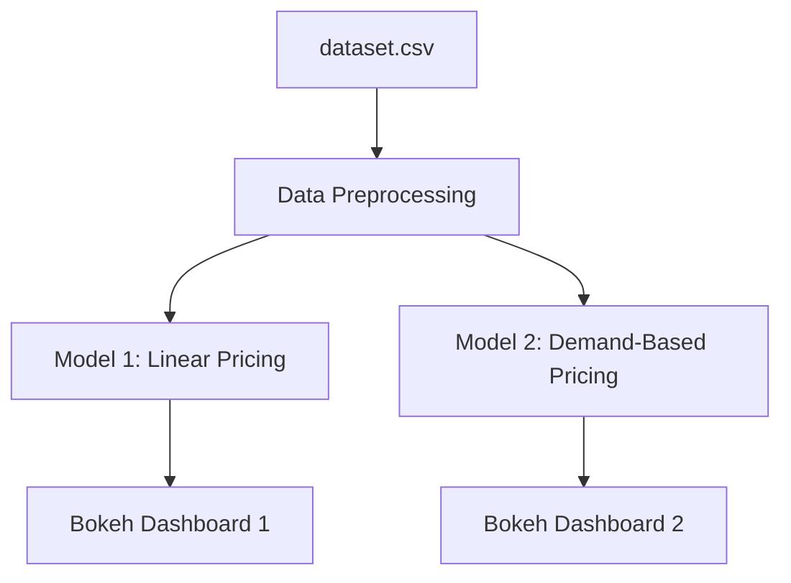
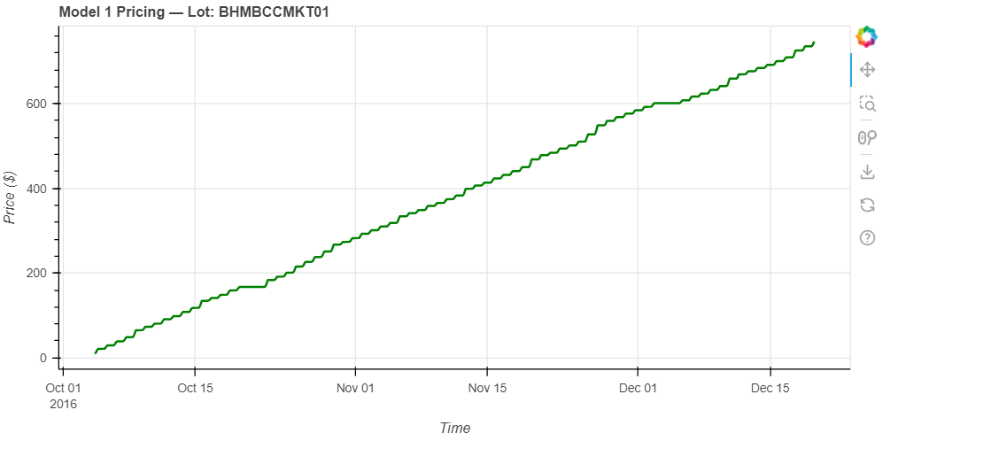
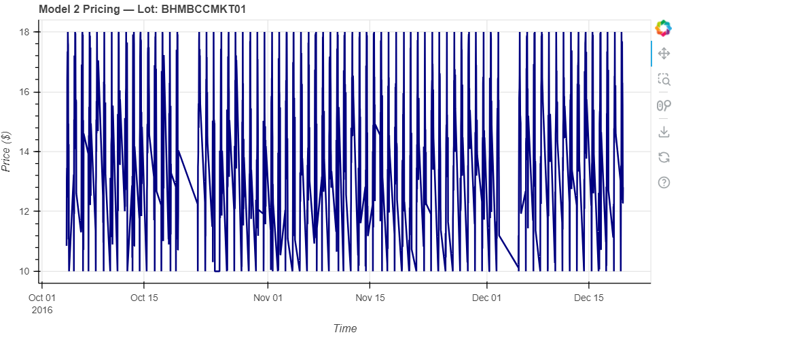

# Business_analytics_project
  Dynamic Pricing for Urban Parking Lots  
**Capstone Project | Summer Analytics 2025 | IIT Guwahati**

## Project Overview
This project aims to simulate a dynamic real time pricing engine for 14 urban parking lots using real time demand signals such as occupancy, queue length, traffic congestion and special events. The objective is to avoid underutilization or overcrowding by adjusting prices based on real time and historical factors.

Two models were developed:
1. **Model 1 (Linear)**: Pricing based on occupancy
2. **Model 2 (Demand-based)**: Feature-weighted demand function
3. Interactive dashboards were built using **Bokeh** to visualize real time pricing behavior.

## Tech Stack

| Tool/Library| Purpose                        
| pandas      | Data processing and transformation  
| numpy       | Numerical calculations and model logic  
| Bokeh       | Real-time interactive visualization  
| Google Colab| Code development and simulation   
| Mermaid     | Architecture diagrams  

##  Architecture Diagram & Workflow

###  Workflow Explanation

1. **Data Ingestion & Preprocessing**
   - The raw dataset is loaded from CSV using `pandas`
   - Date and time fields are merged into a single timestamp
   - Features like traffic, queue length, and vehicle type are encoded into numeric form

2. **Feature Engineering**
   - `OccupancyRate` is calculated as `Occupancy / Capacity`
   - `VehicleWeight` is derived to represent different vehicle types impact on space and pricing
   - The dataset is sorted by lot and time to simulate real time streaming

3. **Model Execution**
   - **Model 1**: Applies linear price increase with occupancy
   - **Model 2**: Uses a weighted demand function to adjust price based on multiple factors

4. **Visualization**
   - Interactive plots are created with Bokeh to monitor how pricing changes over time per lot
   - Dropdown menu to select parking lot
   - Shows how price evolves over time
   - Model 1: Smooth occupancy-based progression
   - 
   - Model 2: Responsive demand-based variation
   - 

 ## Final Report

[📥 Download Final Report (PDF)](final_report.pdf)

